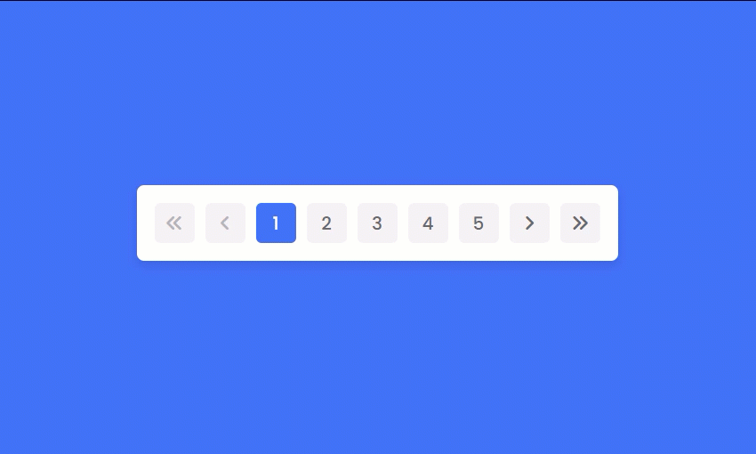

# Pagination System with JavaScript

[](LICENSE)  
[](https://developer.mozilla.org/en-US/docs/Web/JavaScript)  
[](https://github.com/amirAliFeizi/Pagination/issues)

## 🚀 Overview

This project is a **high-performance, fully customizable pagination system** built with vanilla JavaScript, designed to provide smooth navigation through large sets of data. The system dynamically generates page buttons based on the current and total pages, offering a clean and interactive user experience.

## 🛠️ Features

- **Dynamic Page Buttons**: Automatically adjusts visible page numbers based on the current position.
- **Responsive Navigation**: Includes First, Previous, Next, and Last buttons for quick access.
- **Customizable**: Easily set the total number of pages and the maximum visible buttons.
- **Lightweight**: Pure JavaScript implementation with no external dependencies.
- **Accessible**: Designed with accessibility in mind, making it easy to use with keyboard navigation.

## 📸 Demo

  
*Example of the pagination in action.*

## 📂 Project Structure

```plaintext
├── index.html           # Basic HTML structure
├── styles.css           # Minimal styling for the pagination buttons
├── script.js            # Core JavaScript logic for the pagination system
└── README.md            # Documentation of the project
```
## 🧩 Getting Started

Follow these instructions to set up the project locally.

### Prerequisites

* A modern web browser (Chrome, Firefox, Safari)
* Basic understanding of HTML, CSS, and JavaScript.

### Installation

Clone the repository:

```bash
git clone https://github.com/amirAliFeizi/Pagination.git
cd your-repo
```
Open index.html in your browser:

```
open index.html
```
That's it! The pagination system is now running on your local machine.


## 🔧 Usage

* **First Page Button**: Navigates to the first page.
* **Previous Page Button**: Moves back one page.
* **Next Page Button**: Advances to the next page.
* **Last Page Button**: Jumps to the last page.

You can adjust the `totalPages` and `maxVisibleButtons` variables in the `script.js` file to suit your needs.

## 📝 Customization

Modify the following parameters in the `script.js`:

```javascript
const totalPages = 500; // Set the total number of pages
const maxVisibleButtons = 5; // Set the number of visible buttons
```
## 💡 Best Practices

* **Keep the `maxVisibleButtons` value odd for better visual symmetry.**
* **Ensure the `totalPages` accurately reflects the data set for correct pagination behavior.**
## 🤝 Contribution

Contributions are welcome! Here's how you can help:

1. **Fork the project.**

2. **Create a new branch:**

    ```bash
    git checkout -b feature/YourFeature
    ```

3. **Commit your changes:**

    ```bash
    git commit -m 'Add some feature'
    ```

4. **Push to the branch:**

    ```bash
    git push origin feature/YourFeature
    ```

5. **Open a Pull Request.**

For major changes, please open an issue first to discuss what you would like to change.
## 📄 License

This project is licensed under the MIT License - see the [LICENSE](LICENSE) file for details.

## 💬 Contact

For any questions or suggestions, feel free to reach out:

* **Email:** frontify.dev@gmail.com

* **GitHub:** [@amirAliFeizi](https://github.com/amirAliFeizi)

* **Youtube:** [@amirali_feizi](https://www.youtube.com/@amirali_feizi)
